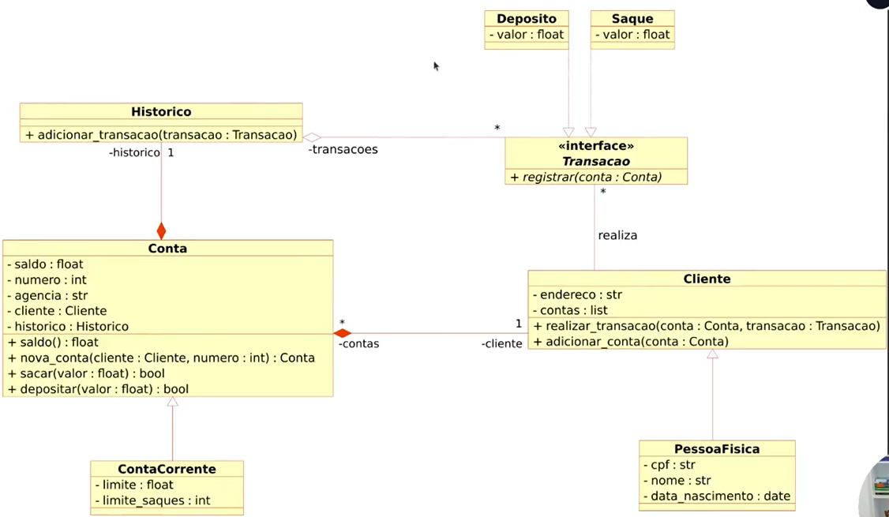

# DESAFIO 1 - Criando um Sistema Bancário com Python
# 👩🏽‍💻Modulando em POO (Programação Orientada a Objetos)👩🏽‍💻
 Bootcamp Suzano Python - Developer 

## 🎯OBJETIVO GERAL 
Criar um sistema bancário com as operações: sacar, depositar e visualizar extrato.

## 📝DESCRIÇÃO 
Fomos contratados por um grande banco para desenvolver o seu novo sistema. Esse banco deseja modernizar suas operações e para isso escolheu a linguagem Python. Para a primeira versão do sistema devemos implementar apenas 3 operações: depósito, saque e estrato.

### 🟥OPERAÇÃO DE DEPÓSITO 
Deve ser possível depositar valores positivos para a minha conta bancária. A versão 1 do projeto trabalha apenas com 1 usuário, dessa forma não precisamos nos preocupar em identificar qual é o número da agência e conta bancária. Todos os depósitos devem ser armazenados em uma variável e exibidos na operação de extrato.

### 🟨OPERAÇÃO DE SAQUE 
O sistema deve permitir realizar 3 saques diários com limite máximo de R$ 500,00 por saque. Caso o usuário não tenha saldo em conta, o sistema deve exibir uma mensagem informando que não será possível sacar o dinheiro por falta de saldo. Todos os saque devem ser armazenados em uma variável e exibidos na operação de extrato.

### 🟪OPERAÇÃO DE EXTRATO 
Essa operação deve listar todos os depósitos e saques realizados na conta. No fim da listagem deve ser exibido o saldo atual da conta
Os valores devem ser exibidos utilizando o formato R$ xxx.xx,
Exemplo: 1500.45 = R$ 1500.45 

## ⚠️Resumo das alterações no código do sistema bancário

1️⃣Correção da variável extrato:
  - A variável extrato foi inicialmente definida como " " (com espaço), o que impedia a exibição correta da mensagem "Não foram realizadas movimentações"
  - Corrigimos para extrato = "" (string vazia), permitindo que o if not extrato funcione corretamente

2️⃣Implementação do cheque especial:
  - Adicionamos a variável cheque_especial = 300, representando um limite extra que o usuário pode usar mesmo com saldo zerado
  - No momento do saque, agora consideramos saldo + cheque_especial como saldo total disponível
  - O extrato passou a exibir, quando o saldo é negativo, quanto do cheque especial foi utilizado

3️⃣Opção de depósito em dinheiro ou cheque:
  - Dentro da operação de depósito, incluímos uma pergunta ao usuário para escolher entre depósito em dinheiro ou cheque
  - O valor é somado ao saldo normalmente, mas o extrato registra o tipo de depósito (ex: “Depósito em dinheiro: R$ 100.00” ou “Depósito em cheque: R$ 150.00”)

## ➕ATUALIZAÇÕES DO DESAFIO 
Na atualização tive a oprotunidade de otimizar o Sistema Bancário previamente desenvolvido com o uso de funções Python. O objetivo foi aprimorar a estrutura e a eficiência do sistema, implementando as operações de depósito, saque e extrato em funções específicas. Tive a chance de refatorar o código existente, dividindo-o em funções reutilizavéis, facilitando a manutenção e o entendimento do sistema como um todo.
Foi integrado ao Sistema bancário três novas funções:
- Criar Usuário: permite a criação de usuários através do número do cpf
- Criar Conta: Permite a criação de conta para o usuário cadastrado. Um usuário pode ter mais de uma conta
- Listar Contas: Lista as contas criadas 

## ⚠️Resumo das alterações no código do sistema bancário feitos com POO

### 🎯OBJETIVO
Iniciar a modelagem do sistema bancário em POO. Adicionar classes para cliente e as operações bancárias: depósito e saque 

### ⚙️DESAFIO⚙️
AtualizaR a implementação do sistema bancário, para armazenar os dados de clientes e contas bancárias em objetos ao invés de dicionários. O código deve seguir o modelo de classe UML a seguir:

 

### ➕DESAFIO EXTRA➕
Após concluir a modelagem das classes e a criação dos métodos. Atualizar os métodos que tratam as opções do menu, para funcionar com as classes modeladas 

